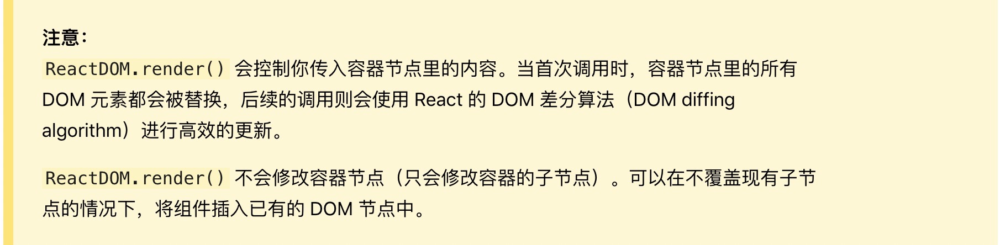

# React 优化更新

### 前提

> react 初学的时候，对于性能这块没什么概念，就是感觉写代码很舒服，模块化、项目工程化，很高大尚的感觉，有没有？到现在为止，用react也做了几个项目了，其他还好，就是项目做大了之后，性能优化不怎么好做，如果页面复杂，特别是需求一直改，就会感觉页面难以维护，繁多的状态，多变的业务，这个时候就很头疼了。
### 对比vue
在 React 应用中，当某个组件的状态发生变化时，**它会以该组件为根，重新渲染整个组件子树**。你需要在所有可能的地方使用 PureComponent，或是手动实现 shouldComponentUpdate 方法。

在 Vue 应用中，组件的依赖是在渲染过程中自动追踪的，所以系统能精确知晓哪个组件确实需要被重渲染。**你可以理解为每一个组件都已经自动获得了定制版的 shouldComponentUpdate，并且没有上述的子树问题限制**。

Vue 的这个特点使得开发者不再需要考虑此类优化，从而能够更好地专注于应用本身。

### render 里面做了什么


ReactDOM.render() 在修改后生成一个新的dom树，然后跟之前的dom树进行比较，更新变化的部分，这一步操作 是最耗性能的一步。

### React diff 策略    

	1.Web UI 中 DOM 节点跨层级的移动操作特别少，可以忽略不计。
	2.拥有相同类的两个组件将会生成相似的树形结构，拥有不同类的两个组件将会生成不同的树形结构。
	3.对于同一层级的一组子节点，它们可以通过唯一 id 进行区分。
[React diff算法](https://segmentfault.com/a/1190000011492275)


### 减少render

**1. 定制 shouldComponentUpdate**

React在组件的生命周期方法中提供了一个钩子shouldComponentUpdate，这个方法默认返回true，表示需要执行每次修改状态，或者属性，都会执行render方法进行diff比较，并更新变化。

通过实现这个方法，并在合适的时候返回false，告诉React可以不用重新执行render，而是使用原有的Virtual DOM 节点，这是最常用的避免render的手段。

shouldComponentUpdate方法会获得两个参数：nextProps及nextState。常见的实现是，将新旧props及state分别进行比较，确认没有改动或改动对组件没有影响的情况下返回false，否则返回true。

注意： **执行render方法不一定会更新**，会进行比较，dom 有变化才会更新

**2. 使用 PureComponent 组件**

PureComponent 和 Component 几乎完全相同，PureComponent 定制了 shouldComponentUpdate，实现了prop和state的浅比较来控制它是否执行render方法，某些情况下可以用PureComponent提升性能

**浅比较**也称引用相等，在javascript中， === 是作浅比较,只检查左右两边是否是同一个对象的引用，简单数据类型比较 就不说了，比较值是不是相等。
复杂的数据比较，例如 对象 ，数组，比较的就是引用，同一个引用 就相等，哪怕值不等，不是同一个引用，哪怕值一样也不等

例1:
```js
constructor(props){
	super(props)
	this.state = { data:[5] }
}
shouldComponentUpdate(nextProps,nextState){
	console.log(nextState.data === this.state.data); 
	// true ,尽管我一直在往数组里面 添加元素，但是每次都是相等的
	return true;
}
click = () => {
	let { data } = this.state;
	data.push(5)
	this.setState({
		data: data
	})
}
```
例2:
```js
constructor(props){
	super(props)
	this.state = { data:[5] }
}
shouldComponentUpdate(nextProps,nextState){
	console.log(nextState.data === this.state.data); 
	// false ,尽管一直都只有一个元素5 ，但是每次都是不相等的
	return true;
}
click = () => {
	this.setState({
		data: [5]
	})
}
```
如上可得出，简单的数据类型传递时是可以使用PureComponent提升性能，而复杂数据类型则不可以使用该组件


**3.不可变数据 seamless-immutable**

共享的可变状态是万恶之源，javascript中的对象一般都是可变的，因为使用了引用赋值，新的对象简单的引用了原始对象，改变新对象将影响到原始对象。

Immutable Data 就是一旦创建，就不能再被更改的数据。对 Immutable 对象的任何修改或添加删除操作都会返回一个新的 Immutable 对象。

[使用immutable优化React](https://segmentfault.com/a/1190000011492275)

[seamless-immutable](https://www.npmjs.com/package/seamless-immutable)

使用 Immutable Data ，配合 shouldComponentUpdate 可以直接进行比较复杂的数据类型，判断新旧状态、属性是否相同，从而控制是否执行render,达到优化性能的目的。

例：
```js
constructor(props){
	super(props)
	this.state = {
		data: Immutable({name:'zs', age:24})
	}
}
shouldComponentUpdate(nextProps,nextState){
	console.log(nextState.data, this.state.data);
	console.log(nextState.data === this.state.data); // false
	return true;
}
click = () => {
	let { data } = this.state;
	data = data.setIn(['name'], 'ls')
	this.setState({
		data: data
	})
}
```
[seamless-Immutable API汇总](https://juejin.im/post/5bf3fa4b6fb9a049cb185c6e)

部分api： Immutable data 数据有自己的api 操作数据，但是  asMutable 转换之后，数据还是用js的方式操作，没有转换的数据直接操作是会报错的
```js
// 以下2种方式 功能是相同的, 把js 的数据类型转化成 不可改变的数据类型
Immutable.from([1, 2, 3]);
let data = Immutable([1, 2, 3]);
	
// 转成可修改的数据，才可以修改数据
Immutable.asMutable(data)
	
//  数组 asMutable 转换之后才可以操作
data.push(5) //添加元素
data[0] = {name: "we", age: 10}
	
// 对象赋值
var obj = {};
let newObj = Immutable.setIn(obj, ['key'], data)

var obj = {};
let newObj = obj.setIn(['key'], data)
```

**4.其他细节**

1. 函数绑定
```js
<Compontent onChange={this.onChange.bind(this)} />
```
通过这种方式绑定，在父组件每次执行render时，都会重新绑一次，该组件都会更新一次。应该把bind 提前
```js
// 绑定this 要在 constructor 里面
constructor(props){
	super(props)
	this.onChange = this.onChange.bind(this)
}
```

2.传参

比较常见的给每个子组件绑定一个点击事件，并拿到数据，做某操作
```js
click = (item) => {
	console.log(item);	
}
render(){
	const { data }  = this.state;
	return(
		 <div>
			{
				data.map((item,index)=>
					<Item key={index} click={()=>this.click(item)} data={item}/>
				)
			}
			</div>
	)
}
```
每次父级执行render 都会生成一个匿名函数，让子组件 Item 更新一次，及时Item 没有任何的更新

可以把方法传给子组件，在子组件内部触发事件，然后调用父级属性 的click 方法，把属性data 传给该方法
```js
class Item extends Component {
    onClick() {
        this.props.click(this.props.data);
    }
    render() {
        //在此this.onClick方法
    }
}
class List extends Component{
	constructor(props){
		super(props)
		this.state = {
			data: [{ name:'zs',age:24 },{ name:'ls', age: 30}]
		}
	}
	click = (item) => {
		console.log(item);	
	}
	render(){
		const { data }  = this.state;
		return(
			 <div >
			 	{
			 		data.map((item,index)=>
			 			<Item key={index} click={this.click} data={item}/>
			 		)
			 	}
		    </div>
		)
	}
}
```
3.render 创建的 object/array

在render 中新创建对象或者数组或者方法，传递给子组件，会造成每次父组件更新，子组件必定更新，因为 更新前和更新后2次创建的必定不一样，大家应该知道 [] !== [] ，原理一样 ，比较的是引用，而非值，所以新创建的自然不一样，就会造成不必要的更新，
如下类似这种可以写在class成员变量里面,还比如 antd 里面 声明table 栏目的变量
```js
render(){
	const data = [1,2,3,4];
	return(
		<div>
			<Example data={data}/>
		</div>
	)
}
```
4. 不要用index 来作为 key 值

key是用来做virtual Dom diff的，不仅要唯一，而且要不变的，否则render 的时候全部都要重新渲染,这也就造成性能浪费


5.其他

- 不影响页面渲染的数据，不要放在 state 中，可以放在成员变量里面，否则数据改变就会触发 render,虽然页面什么都没改变，但是还是会进行 diff 比较

- 多个数据改变，尽量合并成一个 ，一起放到 state 中。

- 在给子组件传递父组件传来的参数时，只传递子组件需要的数据，不要全部传过去，造成数据比较的开销加大,如下
```js
<Child {...this.props}/> //错误方式
```
- 从redux 中取数据 也尽量取自己需要的数据，跟上面一样 不要图方便，全部取进来，尽量一对一的取值，除非你真的需要用到一个 reducer 里面的全部数据
```js
const mapStateTopProps = (state: any) => ({ ...state.Vod}) //错误方式

const mapStateTopProps = (state: any) => ({ lessonList: state.Vod.list })
```
- (项目中遇到的案例)需要监听滚动条，然后去改变状态，这里面的操作要慎重，可能会造成每滚动一次，render执行了几十上百次，这个开销是很大的

例如
```js
// 这段代码，看逻辑没什么问题，大于、小于168 改变状态，但是对于性能开销是很大的
// 这样写相当于随时都要改变状态，即使状态已经改变了，实际需求只需要改变2次而已
calcScroll(scrollTop: number) {
	if (scrollTop >= 168) {
		this.setState({ isLeftFixed: true });
	} else {
		this.setState({ isLeftFixed: false });
	}
}
// 应该加个判断，在满足条件 或者不满足条件都只执行一次更新。
calcScroll(scrollTop: number) {
	const { isLeftFixed } = this.state;
	if (scrollTop >= 168 && !isLeftFixed) {
		this.setState({ isLeftFixed: true });
	} else  if (scrollTop < 168 && isLeftFixed) {
		this.setState({ isLeftFixed: false });
	}
}
```
### 结束
本次分享就到这里，主要就是列出react几个减少更新的方法，看着其实很简单，但是在项目中，肯定有很多意外，项目以实现需求为最终目的，在这中间只能说尽量吧，
尽量去减少性能开销，形成习惯，时间长了对谁都有好处。有误之处，欢迎指正 谢谢
